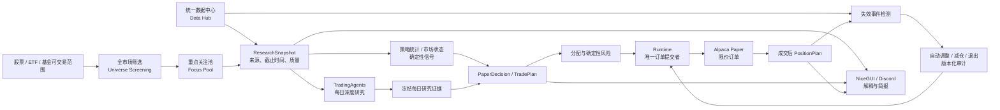

# 目标架构与数据边界

状态：目标架构；本文不改变当前 Runtime 行为。  
产品定义见 [PRODUCT_OPERATING_MODEL.md](PRODUCT_OPERATING_MODEL.md)。

## 明确边界

| 组件 | 责任 | 禁止事项 |
| --- | --- | --- |
| Data Hub | 拉取、标准化、记录来源和质量，生成研究快照 | 不下单，不以 LLM 文本替代事实数据 |
| TradingAgents | 读取受控研究输入，生成每日分析证据 | 不直接连接 broker，不逐 tick 执行 |
| Runtime | 读取当前有效证据、生成/执行计划、轮询订单、持久化审计 | 不绕过风险、幂等性、Kill Switch 或计划版本约束 |
| Position Lifecycle | 冻结成交基线，处理失效事件和自动调整 | 不因次日研究静默重写持仓计划 |
| NiceGUI / Discord | 展示依据、状态和简报 | 不作为订单执行者或逐笔人工审批门槛 |

## 目标数据所有权

Data Hub 应为每个字段保存 `source`、`fetched_at`、`as_of`、`quality`、`fallback_used` 与失败原因。建议的领域优先级：

| 领域 | 主源 | 补充源 |
| --- | --- | --- |
| 可执行行情、账户、订单、成交 | Alpaca | 本地缓存；Yahoo Finance 仅作为显式降级/研究补充 |
| 公司披露、财务、内幕 | SEC EDGAR | Yahoo Finance / TradingAgents 适配器 |
| 新闻、事件与日历 | Finnhub、Nasdaq、WallStreetCN | Yahoo Finance、RSS |
| 宏观、情绪与预期 | FRED | StockTwits、Reddit、Polymarket |
| 研究结论质量 | 本地策略 holdout、系统成交事实 | TradingAgents 的每日证据 |

TradingAgents 是分析消费者与补充覆盖来源，不是另一条不透明的生产数据管线。目标状态下，它应收到已版本化的快照或其明确引用；其外部抓取能力只能作为记录在快照中的适配器结果。

## 核心对象契约

| 对象 | 作用 | 最小不可变/可审计字段 |
| --- | --- | --- |
| `ResearchSnapshot` | 某次研究可使用的事实输入 | `snapshot_id`、symbol、as_of、source manifest、quality、payload version |
| `ResearchRun` | 每日研究批次 | run id、交易日、输入快照、模型/规则版本、输出、状态 |
| `CandidatePlan` | 可每天变化的候选 | 假设、方向、触发条件、证据引用、失效条件 |
| `FinalTradePlan` | 可提交的最终计划 | plan id、风险检查版本、订单意图、证据引用、有效窗口 |
| `PositionPlan` | 成交后的连续计划 | position id、初始版本、止损/目标、版本链、恢复状态 |
| `InvalidationEvent` | 可自动改变持仓的事实 | 类型、来源、as_of、确定性规则、影响范围 |
| `PositionAdjustment` | 自动产生的操作 | 原/新版本、原因事件、订单意图、审计结果 |
| `OrderIntent` | 幂等执行输入 | idempotency key、限价条件、数量、plan/version 引用 |

## 自动执行契约

1. 系统可以拒绝候选计划；这不是人工审批。
2. 一旦计划成为 `FINAL_EXECUTABLE`，在 Paper 自动交易配置有效时 Runtime 自动执行；没有逐笔确认状态。
3. 所有自动订单仍必须经过既有的策略、风险、仓位、Kill Switch、幂等、持久化与限价单约束。
4. 持仓调整由可验证的 `InvalidationEvent` 触发，产生可恢复的版本链；每日观点变化本身不构成静默改写。

## 推荐实施顺序

1. **定义契约和持久化迁移**：增加上述对象的 schema、状态机和只读 UI 投影，先不更改下单逻辑。
2. **统一 ResearchSnapshot**：给现有数据调用加来源、时间和质量 manifest，让当前 Runtime/研究仍可按原路径运行。
3. **TradingAgents 适配**：让每日批次消费/产出快照引用，逐项纳入外部数据源，保留显式降级。
4. **Position Lifecycle**：成交建立 `PositionPlan`；实现重启恢复、失效事件和版本化自动调整。
5. **全市场筛选扩展**：在成本、流动性和数据质量门槛下扩展 universe，再将优质对象送入深度研究。

每一步都应是独立垂直任务：限定模块、不改 UI/遗留 Agent（除非任务明确包含）、补回归测试、运行相关测试与全量 `pytest`。在目标功能实际实现前，现有 `AGENTS.md` 的生产安全边界优先。
